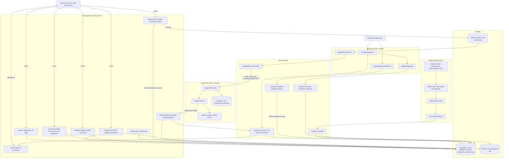

# Architecture: Competitive Programming Website (Rails + Judge0 CE)

## Full Diagram

```mermaid
flowchart TB
    Browser["Browser: Hotwire Turbo and Stimulus"]

    subgraph Web["Rails application: web process"]
        Auth["Devise: registration and login"]
        PC["ProblemsController: catalog and problems"]
        SC["SubmissionsController: submitting solutions"]
        CC["ContestsController: tournaments and registration"]
        PrC["ProfilesController: profile and rating"]
        Hook["Judge0WebhookController: receiving verdicts"]
        Cable["ActionCable: live scoreboard"]
        Admin["Admin panel: Administrate"]
    end

    subgraph Svc["Service objects"]
        J0C["Judge0Client: HTTP client"]
        Gen["Contests::Generator: problem selection"]
        Score["Contests::Scoring: ICPC points and penalty"]
        Rate["Ratings::Calculator: Codeforces-style Elo"]
        Imp["Problems::Importer"]
    end

    subgraph Jobs["Background jobs: Sidekiq"]
        JJ["JudgeSubmissionJob"]
        JG["GenerateDailyContestsJob"]
        JF["FinalizeContestJob"]
        JR["UpdateRatingsJob"]
    end

    Cron["Scheduler: sidekiq-cron"]

    subgraph Data["Storage"]
        PG[("PostgreSQL: users, problems, contests, submissions, rating_history")]
        Redis[("Redis: job queue and ActionCable")]
        Files[("Test files: ActiveStorage or disk")]
    end

    subgraph Judge["Judge0 CE: Docker, isolated"]
        JAPI["Judge0 API server"]
        JW["Judge0 workers"]
        Box["isolate: sandbox, Python and C++"]
        JDB[("Judge0: its own PostgreSQL and Redis")]
    end

    subgraph Offline["Offline problem import"]
        HF["Datasets: open-r1/codeforces, CodeContests, TACO"]
        Py["Python script: filtering and test validation"]
        Dump["JSON and test files"]
        Rake["rake import:problems"]
    end

    Browser -->|HTTP| Auth
    Browser -->|HTTP| PC
    Browser -->|HTTP| SC
    Browser -->|HTTP| CC
    Browser -->|HTTP| PrC
    Browser <-->|WebSocket| Cable

    Auth --> PG
    PC --> PG
    PC --> Files
    CC --> PG
    PrC --> PG
    Admin --> PG

    SC -->|"create submission: queued"| PG
    SC -->|"enqueue"| Redis
    Redis --> JJ
    JJ --> J0C
    J0C -->|"batch: code, stdin, expected_output, limits"| JAPI
    JAPI --> JDB
    JAPI --> JW
    JW --> Box
    JW -->|"callback with verdict"| Hook
    Hook --> PG
    Hook --> Score
    Score --> PG
    Score --> Cable

    Cron --> JG
    Cron --> JF
    JG --> Gen
    Gen -->|"select problems by rating"| PG
    JF --> Score
    JF --> JR
    JR --> Rate
    Rate --> PG

    HF --> Py
    Py --> Dump
    Dump --> Rake
    Rake --> Imp
    Imp --> PG
    Imp --> Files
```
